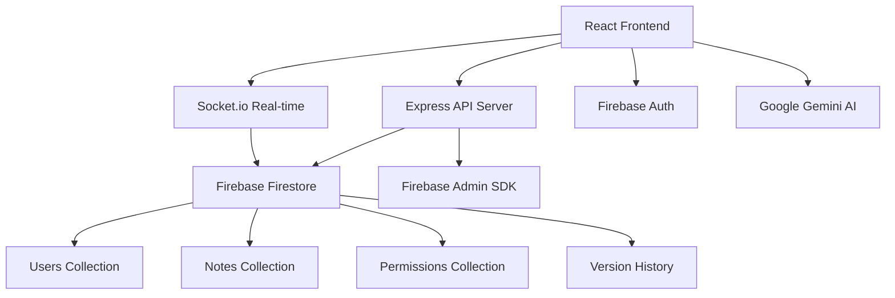

# Smart Notes - Intelligent Collaborative Note-Taking Application

A modern, full-stack collaborative note-taking application with real-time synchronization, AI-powered assistance, and comprehensive sharing capabilities.

## 🚀 Features

### Core Functionality
- **Rich Text Editing** - Advanced text editor with formatting options
- **Real-time Collaboration** - Multiple users can edit notes simultaneously
- **Version History** - Track and revert to previous versions of notes
- **Smart Sharing** - Granular permission system (read, write, admin)
- **Cloud Storage** - All notes stored securely in Firebase Firestore

### AI-Powered Assistance
- **Content Suggestions** - AI-generated writing suggestions based on context
- **Smart Completion** - Intelligent paragraph and sentence completion
- **Title Generation** - Automatic title suggestions based on content
- **Content Analysis** - Writing improvement recommendations
- **Google Gemini Integration** - Powered by Google's advanced AI model

### User Experience
- **Google Authentication** - Secure single sign-on with Google
- **Responsive Design** - Works seamlessly on desktop, tablet, and mobile
- **Material UI** - Modern, intuitive user interface
- **Real-time Updates** - Live synchronization across all devices
- **Offline Support** - Continue working even without internet connection

## 🏗️ Architecture

### Technology Stack

#### Frontend
- **React 19** with TypeScript
- **Material UI** for component library
- **Draft.js** for rich text editing
- **Firebase Auth** for authentication
- **Socket.io Client** for real-time communication
- **Google Generative AI SDK** for AI features
- **React Router** for navigation

#### Backend
- **Node.js** with Express.js
- **Firebase Admin SDK** for authentication and database
- **Socket.io** for real-time collaboration
- **Google Firestore** as primary database
- **JWT** for secure API communication

#### Database Design
```
Collections:
├── users/                  # User profiles and settings
├── notes/                  # Note content and metadata
├── permissions/            # Access control for shared notes
└── noteVersions/          # Version history tracking
```

### System Architecture



## 📁 Project Structure

```
Smart Notes/
├── backend/                    # Node.js Express API
│   ├── config/                # Database and Firebase configuration
│   │   ├── db.js
│   │   ├── firebase.js
│   │   └── firestore.js
│   ├── controllers/           # Business logic handlers
│   ├── middleware/            # Authentication middleware
│   │   └── auth.js
│   ├── models/               # Data models
│   │   ├── Note.js           # Note CRUD operations
│   │   └── User.js           # User management
│   ├── routes/               # API endpoints
│   │   ├── auth.js           # Authentication routes
│   │   ├── notes.js          # Note management
│   │   └── users.js          # User operations
│   ├── package.json
│   └── server.js             # Main server entry point
│
└── frontend/                   # React TypeScript application
    ├── public/                # Static assets
    ├── src/
    │   ├── components/        # Reusable UI components
    │   │   ├── Layout.tsx     # Main app layout
    │   │   └── AISuggestions.tsx
    │   ├── contexts/          # React Context providers
    │   │   ├── AuthContext.tsx    # Authentication state
    │   │   └── NotesContext.tsx   # Notes state management
    │   ├── firebase/          # Firebase configuration
    │   │   └── config.ts
    │   ├── pages/             # Main application pages
    │   │   ├── Dashboard.tsx      # Notes dashboard
    │   │   ├── Login.tsx          # Authentication page
    │   │   ├── NoteEditor.tsx     # Rich text editor
    │   │   └── ShareNote.tsx      # Note sharing interface
    │   ├── services/          # External service integrations
    │   │   ├── ai.ts              # Google Gemini AI service
    │   │   ├── api.ts             # Backend API client
    │   │   └── socket.ts          # Real-time communication
    │   ├── App.tsx            # Main application component
    │   └── index.tsx          # Application entry point
    ├── package.json
    └── tsconfig.json
```

## 🔄 Application Workflow

### User Authentication Flow
1. User clicks "Sign in with Google"
2. Firebase handles Google OAuth authentication
3. Frontend receives authentication token
4. Backend verifies token and creates/updates user profile
5. User gains access to their personal dashboard

### Note Creation & Editing Flow
1. User creates new note or opens existing note
2. Rich text editor loads with current content
3. Changes auto-save with debounce (prevents excessive API calls)
4. Real-time updates broadcast to all collaborators via Socket.io
5. Version history automatically maintained for significant changes

### Collaboration Workflow
1. **Sharing**: Note owner shares via email with specific permissions
2. **Placeholder Users**: System creates placeholder for non-registered emails
3. **Real-time Sync**: All collaborators see changes instantly
4. **Permission Management**: Granular control (read/write/admin permissions)
5. **Conflict Resolution**: Last-write-wins with real-time conflict indicators

### AI Assistance Workflow
1. **Context Analysis**: AI analyzes current note content
2. **Smart Suggestions**: Generate contextual writing suggestions
3. **Auto-completion**: Complete paragraphs based on partial input
4. **Content Enhancement**: Provide writing improvement recommendations
5. **Title Generation**: Suggest appropriate titles based on content

## 🛠️ Setup Instructions

### Prerequisites
- Node.js (v16 or higher)
- npm or yarn
- Firebase project with Firestore enabled
- Google Cloud Project with Gemini API access

### Backend Setup

1. **Clone and Install**
   ```bash
   cd backend
   npm install
   ```

2. **Environment Configuration**
   Create `.env` file:
   ```env
   PORT=8000
   FRONTEND_URL=http://localhost:3000
   JWT_SECRET=your_jwt_secret_here
   ```

3. **Firebase Setup**
   - Create Firebase project at https://console.firebase.google.com
   - Enable Firestore Database
   - Download service account key as `serviceAccountKey.json`
   - Place in backend root directory

4. **Start Development Server**
   ```bash
   npm run dev
   ```

### Frontend Setup

1. **Install Dependencies**
   ```bash
   cd frontend
   npm install
   ```

2. **Environment Configuration**
   Create `.env` file:
   ```env
   # API Endpoints
   REACT_APP_API_URL=http://localhost:8000/api
   REACT_APP_SOCKET_URL=http://localhost:8000

   # Firebase Configuration
   REACT_APP_FIREBASE_API_KEY=your_firebase_api_key
   REACT_APP_FIREBASE_AUTH_DOMAIN=your_project.firebaseapp.com
   REACT_APP_FIREBASE_PROJECT_ID=your_project_id
   REACT_APP_FIREBASE_STORAGE_BUCKET=your_project.appspot.com
   REACT_APP_FIREBASE_MESSAGING_SENDER_ID=your_sender_id
   REACT_APP_FIREBASE_APP_ID=your_app_id

   # Google Gemini AI
   REACT_APP_GEMINI_API_KEY=your_gemini_api_key
   ```

3. **Start Development Server**
   ```bash
   npm start
   ```

### Production Deployment

#### Backend (Render/Railway/Heroku)
1. Deploy backend with environment variables
2. Update CORS settings for production domain
3. Ensure Firebase service account key is properly configured

#### Frontend (Vercel/Netlify)
1. Build and deploy frontend
2. Update API URLs to production endpoints
3. Configure environment variables in deployment platform

## 📡 API Documentation

### Authentication Endpoints
- `POST /api/auth/register` - Register new user
- `POST /api/auth/login` - Authenticate user  
- `GET /api/auth/profile` - Get user profile

### Notes Management
- `GET /api/notes` - Get all user notes (owned + shared)
- `GET /api/notes/:noteId` - Get specific note
- `POST /api/notes` - Create new note
- `PUT /api/notes/:noteId` - Update existing note
- `DELETE /api/notes/:noteId` - Delete note

### Collaboration Features
- `POST /api/notes/:noteId/share` - Share note with user
- `DELETE /api/notes/:noteId/share/:userId` - Revoke access
- `GET /api/notes/:noteId/collaborators` - Get note collaborators

### Version Control
- `GET /api/notes/:noteId/versions` - Get version history
- `GET /api/notes/:noteId/versions/:versionNumber` - Get specific version

### Real-time Events (Socket.io)
- `join-note` - Join note editing session
- `note-update` - Broadcast content changes
- `user-typing` - Show typing indicators
- `user-left` - Handle user disconnections

## 🔧 Key Features Implementation

### Real-time Collaboration
- **Socket.io Integration**: Bidirectional communication for instant updates
- **Room Management**: Users join note-specific rooms for targeted updates
- **Conflict Resolution**: Operational transformation for concurrent edits
- **Presence Indicators**: Show active collaborators and typing status

### AI-Powered Assistance
- **Google Gemini Integration**: Advanced language model for content generation
- **Context-Aware Suggestions**: AI analyzes current content for relevant suggestions
- **Fallback System**: Graceful degradation to simulated responses if AI unavailable
- **Smart Caching**: Efficient API usage with intelligent request batching

### Permission System
- **Granular Access Control**: Read, Write, and Admin permission levels
- **Placeholder Users**: Share with unregistered emails (auto-migrate on signup)
- **Inheritance Rules**: Logical permission hierarchy and validation
- **Audit Trail**: Track permission changes and access patterns

### Version Management
- **Automatic Versioning**: Save versions on significant content changes
- **Incremental Numbering**: Logical version progression with conflict handling
- **Metadata Tracking**: Store author, timestamp, and change summary
- **Restore Functionality**: Easy rollback to any previous version

## 🔒 Security Features

- **Firebase Authentication**: Industry-standard OAuth with Google
- **JWT Token Validation**: Secure API access with token verification  
- **Role-based Access Control**: Granular permissions for notes and features
- **Input Validation**: Comprehensive data sanitization and validation
- **CORS Protection**: Configured for specific frontend domains
- **Environment Variables**: Sensitive data stored securely

## 🚀 Performance Optimizations

- **Debounced Auto-save**: Prevents excessive API calls during typing
- **Lazy Loading**: Components and routes loaded on demand
- **Efficient Queries**: Optimized Firestore queries with proper indexing
- **Real-time Batching**: Grouped Socket.io updates for better performance
- **Caching Strategy**: Smart caching for frequently accessed data

---

**Smart Notes** - Where intelligent note-taking meets seamless collaboration.
